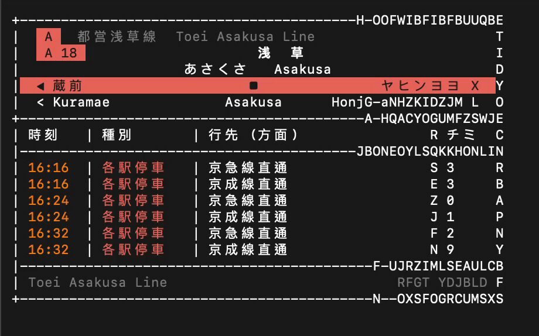

# 🚉 JR / Tokyo Metro Split-Flap Board

**English** · [繁體中文](README.md) · [日本語](README.ja.md)

A terminal simulator of the **split-flap (Solari board) departure signs** at JR / Tokyo Metro stations.

Every refresh first scrambles like an old mechanical station/airport flap board, then locks character-by-character into the real upcoming departures. 20 lines, data-driven, with optional live ODPT data and a single-line marquee mode you can drop into a Claude Code statusline.



```text
+----------------------------------------------------------+
|   JY   山手線  Yamanote Line                             |
|   JY 17                     新  宿                       |
|                  しんじゅく   Shinjuku                   |
|  ◀ 新大久保                ■                   代々木 ▶  |
|  < Shin-Okubo           Shinjuku               Yoyogi >  |
+----------------------------------------------------------+
| 時刻   | 種別       | 行先 (方面)                | 番線  |
|----------------------------------------------------------|
| 15:45  | 各駅停車   | 品川・渋谷方面             | 1     |
| 15:45  | 各駅停車   | 上野・池袋方面             | 2     |
| 15:50  | 各駅停車   | 品川・渋谷方面             | 1     |
| ...    | ...        | ...                        | ...   |
|----------------------------------------------------------|
| Yamanote Line                                src: STATIC |
+----------------------------------------------------------+
```

> The actual terminal output uses each line's official colour (Yamanote green, Ginza orange, Marunouchi red, …).

---

## ✨ Features

- **Real data**: connects to the [ODPT](https://www.odpt.org/) open transit-data API for live timetables; falls back to a built-in realistic static timetable when no key is set. The board honestly labels its source as `src: ODPT` / `src: STATIC` in the bottom-right corner.
- **20 switchable lines**, all data-driven (see the roster below).
- **Split-flap animation**: the classic split-flap / Solari board effect, with tunable speed.
- **Single-line marquee mode**: station pinned, departures scroll — embeddable in a Claude Code statusline.
- **CJK alignment**: uses `east_asian_width` to handle full-width Japanese glyphs (2 cells each), so every row aligns to an exact visual width.

---

## 🚀 Quick start

```bash
# (optional) only needed to fetch live ODPT data
pip install requests

# list all 20 lines and their stations
python3 main.py --list

# full board + flap animation (defaults to Yamanote / Shinjuku, refresh every 10s; Ctrl-C to quit)
python3 main.py
```

`--station` accepts an **English name, station number, or station id**, case-insensitive (e.g. `--station shinjuku`, `--station 17`, `--station JY17`).

```bash
# pick a line/station, render once and exit
python3 main.py --once --line ginza        --station ginza
python3 main.py --once --line keihintohoku --station tokyo --no-flap

# tune the flap speed
python3 main.py --line yamanote --station shinjuku --flap-delay 0.15   # slower, more mechanical
python3 main.py --line yamanote --station shinjuku --flap-steps 8      # fewer frames, snappier

# single-line marquee
python3 main.py --mode statusline --line oedo --station tochomae --columns 70
python3 main.py --mode statusline --line marunouchi --station tokyo --columns 70 --scroll-all
```

---

## 🧩 More modes: TUI, Pomodoro, Commute, Agenda

Beyond the board and statusline, the same CLI exposes four additive modes
(every flag keeps its old behaviour; these are opt-in).

```bash
# interactive curses browser: two panes — a city-grouped, line-coloured line
# list (j/k, / to filter, h/l to step stations, f to favourite, q to quit) and
# a live colour board (split-flap intro when the line/station changes)
python3 main.py --tui

# Pomodoro as a train journey: a focus timer drawn as a ride from origin to
# destination. Auto-picks two stations on the line (or use --from/--to), plays
# the flap intro, then redraws every second until "とうちゃく" (arrival).
python3 main.py --pomodoro 25 --line yamanote
python3 main.py --pomodoro 25 --line yamanote --from shinjuku --to tokyo
python3 main.py --pomodoro 1 --line yamanote --once   # render a single frame

# Commute guardian: "when do I leave to catch the next train?" Needs
# [commute] home/work in the config (see below). Morning → Home→Work,
# afternoon/evening → Work→Home.
python3 main.py --commute                       # full board
python3 main.py --commute --mode statusline     # compact one-liner

# Agenda feed: use a local .ics file as the departure source (label AGENDA)
# instead of the timetable — your next meetings shown like trains.
python3 main.py --feed-ics ~/cal.ics --once
python3 main.py --feed-ics ~/cal.ics --mode statusline --columns 70
```

### Config file

Settings are read from `~/.config/jrboard/config.toml` (respecting
`XDG_CONFIG_HOME`). A missing or malformed file is ignored — defaults always
apply, and CLI flags always override the file.

```toml
[board]
line = "oedo"
station = "tochomae"
columns = 50
width = 60
flap_steps = 22
flap_delay = 0.08

[commute]
home = ["yamanote", "shinjuku"]
work = ["yamanote", "tokyo"]
leave_buffer_min = 7      # walk-to-station buffer in minutes
```

Favourites toggled inside the TUI persist to
`~/.config/jrboard/favorites.txt` (one `line_key,station_key` per line).

### Install / entry point

```bash
pip install -e .        # installs the `jrboard` console script
jrboard --list          # same CLI as `python3 main.py`
jrboard --tui
```

---

## 🚇 Line roster (20)

| Code | `--line` key | Line | Stations | Example station |
|:----:|------|------|:----:|------|
| JY | `yamanote` | Yamanote (loop) | 30 | `shinjuku` |
| JC | `chuo` | Chuo Rapid | 24 | `tokyo` |
| JB | `sobu` | Chuo-Sobu Local | 39 | `akihabara` |
| JK | `keihintohoku` | Keihin-Tohoku-Negishi | 47 | `tokyo` |
| JA | `saikyo` | Saikyo | 19 | `osaki` |
| JS | `shonanshinjuku` | Shonan-Shinjuku | 19 | `shinjuku` |
| JO | `yokosuka` | Yokosuka | 19 | `yokohama` |
| G | `ginza` | Tokyo Metro Ginza | 19 | `ginza` |
| M | `marunouchi` | Tokyo Metro Marunouchi | 25 | `tokyo` |
| H | `hibiya` | Tokyo Metro Hibiya | 22 | `naka-meguro` |
| T | `tozai` | Tokyo Metro Tozai | 23 | `otemachi` |
| C | `chiyoda` | Tokyo Metro Chiyoda | 19 | `yoyogi-uehara` |
| Y | `yurakucho` | Tokyo Metro Yurakucho | 24 | `wakoshi` |
| Z | `hanzomon` | Tokyo Metro Hanzomon | 14 | `shibuya` |
| N | `namboku` | Tokyo Metro Namboku | 19 | `meguro` |
| F | `fukutoshin` | Tokyo Metro Fukutoshin | 16 | `wakoshi` |
| A | `asakusa` | Toei Asakusa | 20 | `asakusa` |
| I | `mita` | Toei Mita | 27 | `meguro` |
| S | `shinjuku` | Toei Shinjuku | 21 | `shinjuku` |
| E | `oedo` | Toei Oedo | 39 | `tochomae` |

> `--line shinjuku` is the **Toei Shinjuku subway line**; the JR lines have their own keys (`chuo`/`sobu`/…).

### 🌏 Other cities (Kyoto / Osaka / Sapporo / Otaru)

Filter by city with `--city`: `python3 main.py --list --city Osaka`; `--rotate --city Osaka` tours only Osaka.

| key | City | Line | Stations |
|------|:----:|------|:----:|
| `osaka-loop` | Osaka | JR Osaka Loop Line (loop) | 19 |
| `osaka-midosuji` | Osaka | Midosuji Line | 20 |
| `osaka-tanimachi` | Osaka | Tanimachi Line | 26 |
| `kyoto-karasuma` | Kyoto | Subway Karasuma Line | 15 |
| `kyoto-tozai` | Kyoto | Subway Tozai Line | 17 |
| `kyoto-randen` | Kyoto | Randen Arashiyama tram | 13 |
| `kyoto-sagano` | Kyoto | JR Sagano Line (San'in) | 15 |
| `kyoto-keihan` | Kyoto | Keihan Main Line | 42 |
| `sapporo-namboku` | Sapporo | Namboku Line | 16 |
| `sapporo-tozai` | Sapporo | Tozai Line | 19 |
| `sapporo-toho` | Sapporo | Toho Line | 14 |
| `otaru-hakodate` | Otaru | JR Hakodate Main Line (Otaru–Sapporo) | 15 |

---

## 🛰️ Live ODPT data

1. Get a free consumer key at <https://developer.odpt.org/>.
2. Set the environment variable and run:

```bash
export ODPT_KEY="your-key"
python3 main.py --line yamanote --station shinjuku   # the board shows src: ODPT
```

On any failure (no key, HTTP error, empty response) it falls back to the static timetable, logs the reason to stderr, and shows `src: STATIC`.

> 🔐 Never hardcode or commit the key — use an environment variable (`.env` is gitignored).

---

## 📟 Embed in the Claude Code statusline

The multi-line board is **not** suited to a statusline (it's 16 lines). Use the single-line `statusline` mode — it pins the station on the left and scrolls the departures past like a light bar:

```text
[JY] 17 新宿 ▸ 15:45 品川・渋谷方面  15:45 上野・池袋方面  15:50 …
```

In `~/.claude/settings.json`:

```json
{
  "statusLine": {
    "type": "command",
    "command": "python3 /path/to/tokyo-train-board/main.py --mode statusline --line yamanote --station shinjuku --columns 80"
  }
}
```

Two inherent statusline constraints (both handled by design):

1. **No TTY**: a statusLine command has no terminal width, so you **must pass `--columns N`** for the marquee to scroll.
2. **Not timer-driven**: Claude Code only re-runs the command on render (during activity), so the marquee advances "one column per refresh" rather than animating smoothly while idle. The scroll offset is derived from the current time, so each refresh lands at a different position.

`--scroll-all` makes the whole line scroll (including the station name).

### Use the csl theme (recommended — a live scrolling marquee)

If you use the [`csl`](https://) statusline theme manager, this project ships a ready-made theme at `integrations/csl/jr-board.sh` (+ manifest). It overrides `render()` to call the marquee above and relies on `settings.json`'s `refreshInterval: 1` for **real scrolling (~1 column/second)**:

```bash
# install the theme into the user tier, then activate it
cp integrations/csl/jr-board.* ~/.config/csl/themes/
csl preview jr-board     # try it once
csl set jr-board         # activate (rewrites settings.json, backed up automatically)
csl set bastille-day     # switch back to your previous theme anytime
```

Tune `JR_LINE` / `JR_STATION` / `JR_COLUMNS` (narrower = more scrolling) / `JR_SCROLL_ALL` at the top of `jr-board.sh`.

---

## 🎞️ Flap animation tuning

| Flag | Default | Effect |
|------|:----:|------|
| `--no-flap` | — | skip the animation, paint the resolved board |
| `--flap-steps N` | 22 | frames from full scramble to resolved; higher = more gradual |
| `--flap-delay S` | 0.08 | seconds held per frame; higher = slower |

The default animation lasts ~2 seconds. The *order* in which characters lock is decided by `lock_threshold()` in `jrboard/flap.py` (currently a left-to-right wipe with mild jitter); change that one function for random-settle or ease-out, no other module touched.

---

## 🏗️ Architecture

**Data-driven**: the engine is line-agnostic — **adding a line = dropping one `jrboard/data/<key>.json`, with no code changes**.

| Module | Responsibility |
|------|------|
| `jrboard/width.py` | CJK / ANSI visual-width measurement and alignment |
| `jrboard/model.py` | `Line` / `Station` data model, loads `data/*.json` |
| `jrboard/sources.py` | timetable sources (ODPT + static fallback, repository pattern) |
| `jrboard/flap.py` | split-flap animation engine (pure, testable) |
| `jrboard/render.py` | board ANSI rendering |
| `jrboard/statusline.py` | single-line marquee |
| `jrboard/cli.py` | argparse CLI and refresh scheduling |
| `jrboard/data/*.json` | per-line station + timetable data |

### Add a line

Drop a `<key>.json` in `jrboard/data/`, following the shape of the existing files:

```jsonc
{
  "key": "tokaido",
  "name_jp": "東海道線", "name_en": "Tokaido Line",
  "symbol": "JT",
  "color": { "name": "...", "ansi_fg": "[38;2;246;139;30m",
             "ansi_bg": "[48;2;246;139;30m[38;2;26;26;26m", "hex": "#F68B1E" },
  "operator": "JR-East",
  "odpt_railway": "odpt.Railway:JR-East.Tokaido",
  "loop": false,
  "stations": [
    { "id": "JT01", "number": "01", "name_jp": "東京", "kana": "とうきょう",
      "name_en": "Tokyo", "odpt_station": "odpt.Station:JR-East.Tokaido.Tokyo" }
  ],
  "timetable": {
    "first_train": "04:30", "last_train": "00:30",
    "headway_min": { "weekday": { "7": 5, "8": 4 }, "holiday": {} },
    "directions": [
      { "id": "down", "name_jp": "熱海方面", "via_jp": "横浜方面", "track": "1" },
      { "id": "up",   "name_jp": "東京方面", "via_jp": "品川方面", "track": "2" }
    ]
  }
}
```

Colours can be regenerated from official hex with `scripts/apply_colors.py` (24-bit truecolor + luminance-chosen badge text).

After saving, `python3 main.py --list` shows the new line immediately.

---

## ✅ Tests

```bash
python3 -m pytest tests -q      # 50 tests
```

Covers: visual width (CJK + ANSI), data model (load / find-station / loop neighbours), timetable sources (static generation and ODPT→static fallback), flap (width preservation, final frame fully resolved), and statusline (pinned label, time-advancing marquee, line colour).
